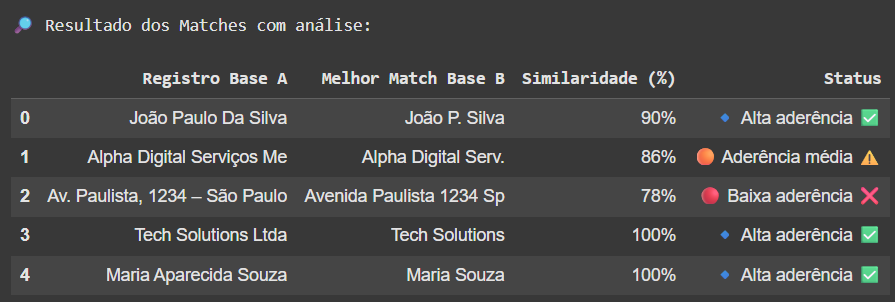

# 📄 Match de nomes com The Fuzz

## 📝 Descrição do Projeto

Este projeto realiza a comparação e análise de similaridade entre registros de duas bases de dados utilizando **fuzzy matching**. Ele é útil para identificar registros duplicados ou inconsistentes em bases de empresas, nomes e endereços.

A implementação usa a biblioteca **thefuzz** (antes conhecida como fuzzywuzzy) para calcular a similaridade entre textos e classifica os resultados com níveis de aderência.

---

## 🚀 Funcionalidades

* Normalização de texto (lowercase e remoção de espaços extras);
* Comparação entre bases usando **token\_set\_ratio**;
* Classificação dos resultados com emojis e mensagens:

  * 🔹 **Alta aderência ✅** (≥ 90%);
  * 🟠 **Aderência média ⚠️** (≥ 80%);
  * 🔴 **Baixa aderência ❌** (< 80%);
* Ordenação do resultado final por percentual de similaridade.

---

## 📦 Requisitos

* Python 3.8+
* Bibliotecas:

  ```bash
  pip install pandas thefuzz
  ```

---

## 💻 Como Executar

1. Clone o repositório:

   ```bash
   git clone https://github.com/seuusuario/match-empresas-fuzzy.git
   cd match-empresas-fuzzy
   ```

2. Execute o script principal:

   ```bash
   python match_empresas.py
   ```

3. O resultado exibirá a tabela com os matches e suas respectivas classificações no terminal.

---

## 📊 Exemplo de Saída

```
🔎 Resultado dos Matches com análise:

      Registro Base A         Melhor Match Base B     Similaridade (%)    Status
0     Tech Solutions Ltda     Tech Solutions          95%                 🔹 Alta aderência ✅
1     Alpha Digital Serviços  Alpha Digital Serv.     88%                 🟠 Aderência média ⚠️
...
```



---

## 📁 Estrutura do Projeto

```
match-empresas-fuzzy/
│
├── match_empresas.py   # Script principal
├── README.md           # Documentação
```

---

## 🤪 Dados de Exemplo

Você pode testar com os dados fictícios diretamente no código:

**Base A**

```
Tech Solutions LTDA
Alpha Digital Serviços ME
João Paulo da Silva
Maria Aparecida Souza
Av. Paulista, 1234 – São Paulo
```

**Base B**

```
Tech Solutions
Alpha Digital Serv.
João P. Silva
Maria Souza
Avenida Paulista 1234 SP
```

---

## 📜 Licença

Este projeto é livre para uso educacional e corporativo.
